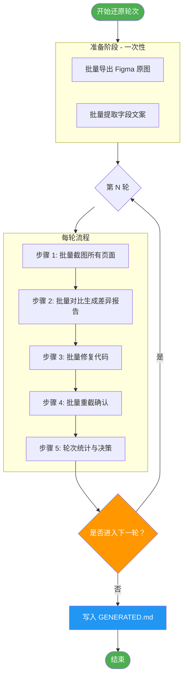

# 视觉还原轮次流程（完善版）

## 🎯 核心原则

**批量处理模式**：还原轮次采用「批量截图 → 批量对比 → 批量修复 → 批量确认」的模式，**不是**逐页截图还原。

### ❌ 错误理解（你描述的流程）

```
第一轮：
  截图第 1 页 → 还原第 1 页 → 截图第 2 页 → 还原第 2 页 → ... → 截图第 N 页 → 还原第 N 页

第二轮：
  重新截图第 1 页 → 还原第 1 页 → 重新截图第 2 页 → 还原第 2 页 → ...
```

**问题**：
- 每页单独截图会导致上下文丢失（登录态、侧栏状态、全局样式）
- 每次截图都要重新登录、重新加载，效率极低
- 无法批量对比，无法生成整体报告
- 无法追踪轮次状态（当前第几轮、修复了多少、还剩多少）

---

### ✅ 正确流程（完善后的流程）

```
准备阶段（一次性）：
├─ 批量导出所有 Figma 原图 → imports/figma/screens/
├─ 批量提取所有字段文案 → fixtures/figma-fields.json
└─ 后续轮次复用，除非新增页面

第一轮：
├─ 批量截图：Playwright 一次性截取所有运行时页面 → artifacts/visual-diff/round-1/actuals/
├─ 批量对比：生成所有页面的热力图和差异报告 → artifacts/visual-diff/round-1-differences.json
├─ 批量修复：根据差异清单一次性修复所有代码
├─ 批量确认：重截所有已改页面，确认差异已关闭
└─ 轮次统计：显示「累计修复数 / 剩余差异数」，询问是否进入下一轮

第二轮：
├─ 批量截图：Playwright 一次性截取所有运行时页面（用修复后的代码）→ artifacts/visual-diff/round-2/actuals/
├─ 批量对比：生成剩余差异报告 → artifacts/visual-diff/round-2-differences.json
├─ 批量修复：修复剩余差异
├─ 批量确认：重截确认
└─ 轮次统计

...重复直至用户选择「不进入下一轮」
```

---

## 📋 详细步骤

### 第 0 步：准备阶段（一次性，所有轮次复用）

**目标**：批量导出 Figma 原图和字段文案，作为后续所有轮次的对照基准。

```bash
# 1. 批量导出所有 Figma 页面截图（含弹窗）
npm run visual:shots:all

# 2. 批量提取 Figma 节点文本（字段文案的权威依据）
node scripts/extract-figma-texts.mjs <FILE_KEY>

# 3. 确认导出完成
ls imports/figma/screens/      # 应有 N 张 PNG（N = 页面数 + 弹窗数）
ls fixtures/figma-fields.json  # 应有所有字段的 JSON
```

**产出**：
- `imports/figma/screens/*.png` — 所有 Figma 原图（后续轮次复用，除非新增页面）
- `fixtures/figma-fields.json` — 所有字段文案（后续轮次复用）

**注意**：
- 如果 Figma REST 返回 429 限流，等待后重试（不要跳过）
- 此步骤只需执行一次，后续轮次不需要重复导出

---

### 第 N 轮还原流程（N = 1, 2, 3...）

#### 步骤 1：批量截图（一次性截完所有页面）

```bash
# 确认 api + web 已启动
# 页面 URL 加 ?visualGate=1 冻结 sample 数据

# 批量截图所有页面（自动遍历 screenConfigs.ts 的路由）
node scripts/capture-screens.mjs --round=1

# 产出：artifacts/visual-diff/round-1/actuals/*.png
```

**说明**：
- 一次性登录（Token 存入 localStorage）
- 一次性遍历所有路由（按 `screenConfigs.ts`）
- 统一视口（从 Layout IR 动态读取，不再硬编码 1440×1068）
- 统一等待时间（`networkidle` + 字体加载完成）

---

#### 步骤 2：批量对比（生成差异报告和热力图）

```bash
# 批量对比 Figma 原图 vs 运行时截图
node scripts/visual-compare.mjs --round=1

# 产出：
# - artifacts/visual-diff/round-1/diff/*.png（热力图）
# - artifacts/visual-diff/round-1-differences.json（差异清单）
# - artifacts/visual-diff/round-1-report.html（HTML 交互报告）
```

**差异清单格式**（`round-1-differences.json`）：

```json
{
  "round": 1,
  "timestamp": "2026-09-14T10:00:00Z",
  "totalScreens": 15,
  "screensWithDiff": 8,
  "differences": [
    {
      "screen": "departments",
      "type": "field",
      "category": "critical",
      "field": "columns[0].title",
      "expected": "科室图标",
      "actual": "排序",
      "file": "apps/web/src/pages/DepartmentsPage.tsx:23",
      "status": "pending"
    },
    {
      "screen": "home",
      "type": "visual",
      "category": "non-critical",
      "region": "KPI 卡片间距",
      "expected": "16px",
      "actual": "20px",
      "file": "apps/web/src/styles/app.css:45",
      "ssim": 0.923,
      "mismatch": 0.08,
      "status": "pending"
    }
  ],
  "statistics": {
    "totalDiffs": 45,
    "critical": 12,
    "nonCritical": 33,
    "fieldDiffs": 28,
    "visualDiffs": 17,
    "criticalAligned": 100%,
    "nonCriticalAligned": 93%
  }
}
```

**热力图增强**：
- 差异区域用亮红色标注（`rgba(255, 0, 0, 0.7)`）
- 每个区域显示差异百分比（如「差异 15%」）
- 生成 HTML 交互报告（可点击跳转差异区域）
- 终端输出 ASCII 热力图（使用 chalk 彩色）

**终端输出示例**：
```
🔴 视觉闸门失败：首页 SSIM 0.923 < 0.97
   差异区域:
   ┌─────────────────────────────────────┐
   │ 顶栏图标    [████████░░] 差异 18%   │
   │ KPI 卡片    [██████░░░░] 差异 12%   │
   │ 图表标题    [██░░░░░░░░] 差异 4%    │
   └─────────────────────────────────────┘
   查看详情：artifacts/visual-diff/round-1-report.html
```

---

#### 步骤 3：批量修复代码

**差异分类处理**：

| 类型 | 修复方式 | 示例 |
|---|---|---|
| **字段差异（critical）** | 必须 100% 修复 | 列名、表单字段、弹窗字段、KPI 标题 |
| **字段差异（non-critical）** | 允许 5% 差异 | placeholder、hint、footer 文案 |
| **视觉差异** | SSIM ≥ 0.97 | 间距、颜色、字体大小、圆角 |

**修复代码差异表**：
```markdown
| 屏 | 类型 | 差异 | 拟改文件 | 状态 |
|---|---|---|---|---|
| departments | field-critical | "排序" → "科室图标" | DepartmentsPage.tsx:23 | ✅ 已修复 |
| home | visual | KPI 间距 20px → 16px | app.css:45 | ✅ 已修复 |
| schedules | field-non-critical | placeholder 文案微调 | SchedulePage.tsx:67 | ⚠️ 可接受（5% 内） |
```

**批量修复脚本**（可选）：
```bash
# 自动修复字段差异（从 figma-fields.json 读取）
node scripts/auto-fix-fields.mjs --round=1

# 注意：视觉差异仍需手动修复（间距、颜色等）
```

---

#### 步骤 4：批量确认（重截已改页面）

```bash
# 重截所有已修复的页面
node scripts/capture-screens.mjs --round=1 --screens=departments,home,schedules

# 自动对比确认
node scripts/visual-compare.mjs --round=1 --verify-only

# 输出：
# ✅ departments: SSIM 0.982 (通过)
# ✅ home: SSIM 0.976 (通过)
# ✅ schedules: SSIM 0.991 (通过)
# 
# 本轮差异已关闭：3/3
```

**如果仍有差异**：
- 标记为「未关闭」，加入下一轮修复清单
- 如果是非关键字段（5% 差异内），标记为「可接受」

---

#### 步骤 5：轮次统计与决策

**输出统计报告**：
```
🔄 第 1 轮字段还原和页面还原已完成

📊 统计报告：
├─ 总字段数：156 个
├─ 已修复字段：142 个（91%）
├─ 剩余差异：14 个
│   ├─ 关键字段：0 个 ✅
│   └─ 非关键字段：14 个（placeholder/hint）
├─ 本轮修复：28 个
├─ 累计修复：142 个
├─ 关键字段对齐率：100% ✅
├─ 非关键字段对齐率：93% ✅
└─ 视觉闸门通过率：100% (15/15 屏 SSIM ≥ 0.97)

🔍 剩余差异详情（非关键字段，允许 5% 差异）：
├─ 新增预约弹窗.placeholder: "选择科室" vs "请选择就诊科室"
├─ 排班管理.hint: "患者最多可提前 N 天预约" vs "预约提前天数限制"
└─ ...（共 14 个）

❓ 是否进入第 2 轮还原？
   进入 / 下一轮 / 继续 → 从步骤 1 再跑一轮
   不进入 / 结束 / 停止 → 写 GENERATED.md，本阶段结束
```

**轮次状态管理**（`artifacts/visual-diff/rounds.json`）：
```json
{
  "currentRound": 1,
  "history": [
    {
      "round": 1,
      "timestamp": "2026-09-14T10:00:00Z",
      "totalDiffs": 45,
      "fixed": 38,
      "remaining": 7,
      "criticalRemaining": 0,
      "nonCriticalRemaining": 7,
      "decision": "continue"
    }
  ],
  "finalStatus": {
    "totalRounds": 1,
    "criticalFieldsAligned": 100%,
    "nonCriticalFieldsAligned": 93%,
    "visualScreensPassed": 100%,
    "completed": false
  }
}
```

---

## 📏 字段分类与可接受差异

### 关键字段（必须 100% 对齐）

- `columns[].title` — 列表列标题
- `formFields[].label` — 表单字段标签
- `modalFields[].label` — 弹窗字段标签
- `stats[].title` — KPI 标题
- `actions[].text` — 按钮文案
- `title` / `subtitle` — 页面标题/副标题
- `sections[].title` — 分组/小节标题
- `formCard.title` — 表单卡片标题
- `hint` — 字段说明文案（如「患者最多可提前 N 天预约」）

### 非关键字段（允许 5% 字符差异）

- `placeholder` — 占位符文案
- `emptyText` — 空状态文案
- `footerText` — 页脚文案
- `helpText` — 帮助文本

### 差异计算规则

```javascript
// 关键字段：必须 100% 匹配
if (category === 'critical') {
  return exactMatch ? 0 : 1; // 0 = 无差异，1 = 有差异
}

// 非关键字段：允许 5% 字符差异
const diffRatio = levenshteinDistance(original, generated) / original.length;
return diffRatio > 0.05 ? 1 : 0; // > 5% 才算差异
```

---

## ✅ 验收标准（交付前必须满足）

| 标准 | 要求 | 测量方法 |
|---|---|---|
| **关键字段对齐率** | 100% | `screenConfigs.ts` 中 `"needsReview": true` 数量 = 0 |
| **非关键字段对齐率** | ≥ 95% | 字段一致性脚本核对 |
| **视觉闸门通过率** | 100% | 所有屏 SSIM ≥ 0.97 或 mismatch < 2% |
| **轮次决策** | 用户明确「不进入下一轮」 | `rounds.json` 中 `decision: "stop"` |
| **文档更新** | GENERATED.md 完成 | 包含轮次统计、剩余差异说明 |

---

## ❓ 常见问题

### Q: 如果 Figma 限流（429）怎么办？

A: 第 0 步批量导出时如遇 429，等待 `Retry-After` 头部指定的秒数后重试。不要跳过任何页面。

### Q: 如果某些非关键字段差异永远无法修复（如 Figma 导出问题）？

A: 标记为「可接受差异」，在 GENERATED.md 中说明原因。只要非关键字段对齐率 ≥ 95% 即可交付。

### Q: 最多可以跑多少轮？

A: 没有硬性限制，由用户决定。建议：
- 如果第 3 轮后仍有 > 10 个差异，检查是否有关键字段遗漏
- 如果第 5 轮后仍有差异，考虑是否降低非关键字段标准（如从 95% 降到 90%）

### Q: 如何查看每轮的详细差异？

A: 查看 `artifacts/visual-diff/round-N-differences.json` 和 `round-N-report.html`。

### Q: 为什么不能逐页截图还原？

A: 逐页截图的问题：
1. **上下文丢失**：每页都要重新登录、重新加载侧栏状态
2. **效率极低**：15 个页面就要登录 15 次，截图 15 次
3. **无法批量对比**：无法生成整体报告，无法追踪轮次状态
4. **容易遗漏**：没有统一的差异清单，修复时容易遗漏某些页面

批量处理的优势：
1. **一次性登录**：Token 存入 localStorage，所有页面复用
2. **一次性对比**：生成统一的差异报告，清晰明了
3. **状态追踪**：明确知道修复了多少、还剩多少
4. **效率提升**：15 个页面只需截图 1 次、对比 1 次、确认 1 次

---

## 📊 流程图



---

## 📁 产物目录结构

```
artifacts/visual-diff/
├── rounds.json                    # 轮次状态管理
├── round-1/
│   ├── actuals/                   # 运行时截图
│   │   ├── home.png
│   │   ├── departments.png
│   │   └── ...
│   ├── diff/                      # 热力图
│   │   ├── home.diff.png
│   │   ├── departments.diff.png
│   │   └── ...
│   ├── round-1-differences.json   # 差异清单
│   └── round-1-report.html        # HTML 交互报告
├── round-2/
│   └── ...                        # 同上
└── ...
```

---

## 🎯 关键改进点总结

相比你描述的流程，完善后的流程有以下关键改进：

1. **批量处理**：从「逐页截图还原」改为「批量截图 → 批量对比 → 批量修复 → 批量确认」
2. **准备阶段一次性**：Figma 原图和字段文案只需导出一次，所有轮次复用
3. **状态管理**：添加 `rounds.json` 追踪每轮的修复数、剩余数、决策
4. **差异分类**：区分关键字段（100% 对齐）和非关键字段（允许 5% 差异）
5. **热力图增强**：生成 HTML 交互报告 + 终端 ASCII 热力图
6. **轮次统计**：每轮显示「累计修复数 / 剩余差异数」，清晰明了
7. **自动化确认**：重截确认自动化，不再依赖人工判断

---

## 📝 更新记录

- **2026-09-14**：完善视觉还原轮次流程，明确批量处理模式，添加字段分类和可接受差异标准
- 待实施：添加 `scripts/capture-screens.mjs`、`scripts/visual-compare.mjs`、`scripts/auto-fix-fields.mjs` 等脚本
- 待实施：更新 `visual-gate.mjs` 支持动态视口和轮次状态管理
